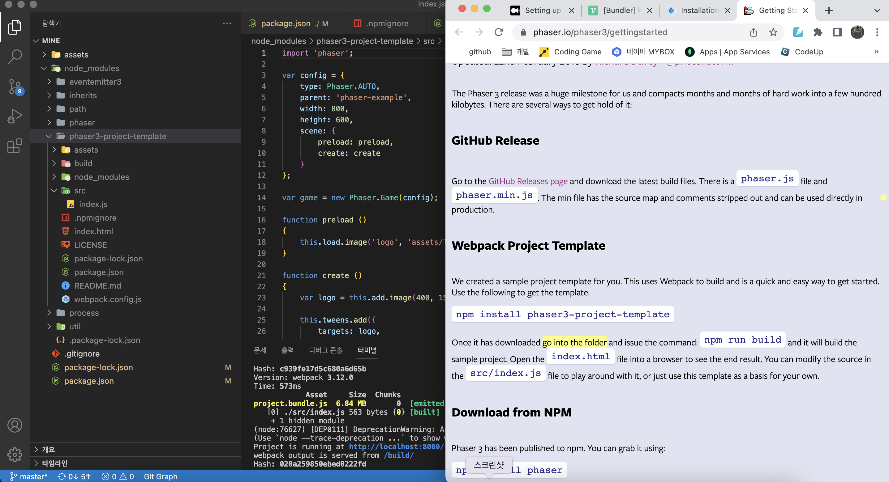
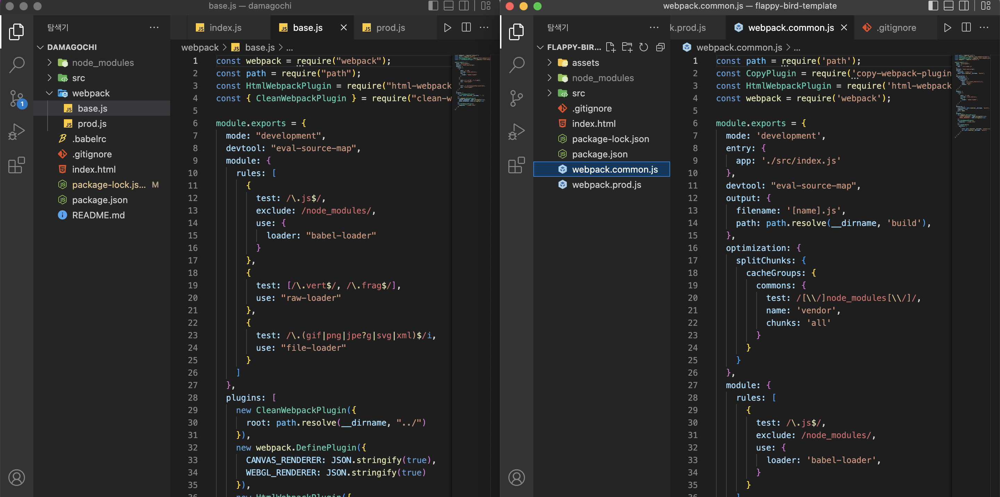
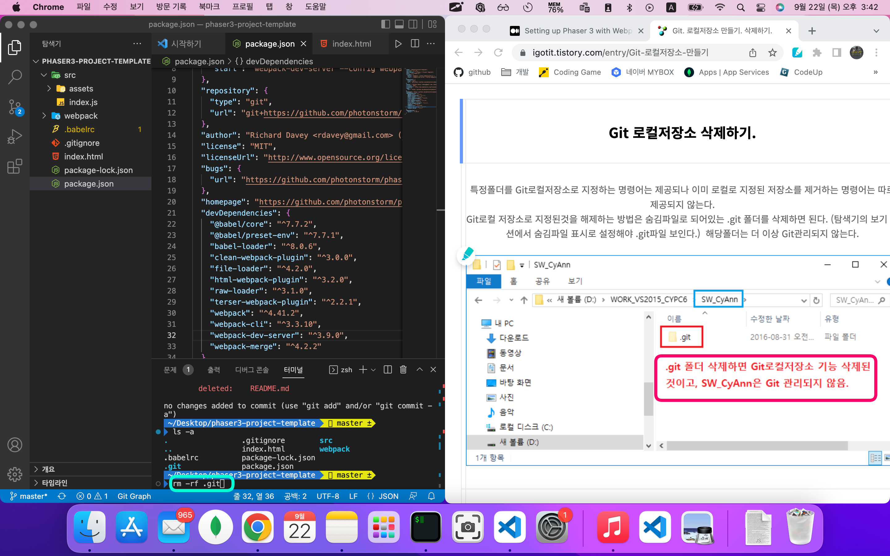
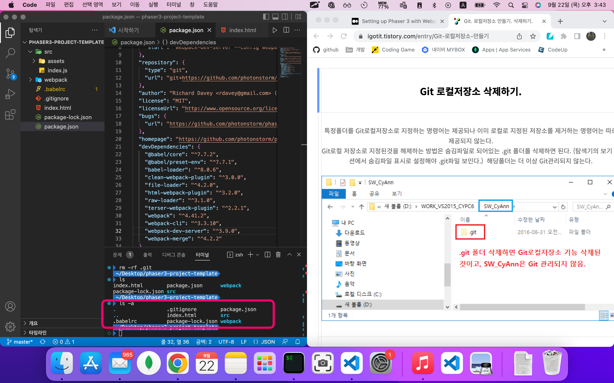
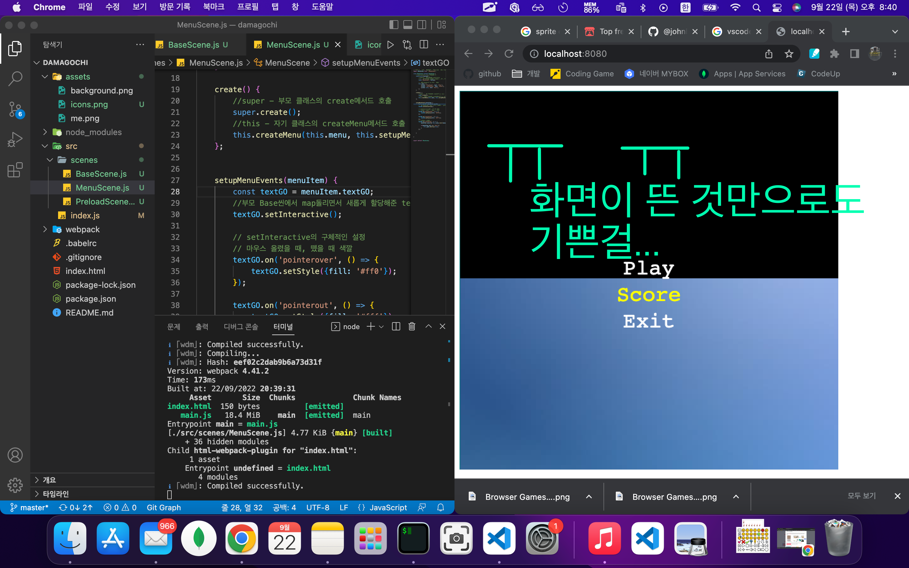

# TIL (Today-I-Learned) : 오늘 배운 내용을 README에 커밋으로 기록합니다.

<!-- 1️⃣ 날짜 및 기분 작성 -->
# 🗓 22.09.23(목) &nbsp;&nbsp;&nbsp;&nbsp;&nbsp;&nbsp;&nbsp;&nbsp;&nbsp;&nbsp;&nbsp;&nbsp;&nbsp;&nbsp; 기분: 🥰


<!-- 2️⃣ 대표문장 작성 -->
시행착오
-------------
<!-- 강조라인 -->


<!-- 3️⃣ 배운 내용 요약 -->
<!-- > 소프트 스킬
1. flappy-bird 파트 완강
  * 응용해서 개별 프로젝트 시작
   -->
> 오늘의 문제 해결 🐛
1. 페이저 기본 세팅을 검색했더니 phaser에서 제공하는 템플릿이 있었다.
  * </img>

2. 🔥시키는대로 프로젝트 파일을 만들고 거기서 npm install -> npm run build를 했는데, 작동하지 않았다. 
  * </img>
  * 그 이유는 npm install -> npm run build를 패키지 모듈안에서 해야 했기 때문. 하지만 거기서 템플릿을 만들어도 node_modules안에서 쓸 수는 없는 노릇

3. 그러면 node_modules안에서 프로젝트를 만들고 그 파일만 빼서 사용하면 되지 않을까 생각했는데, 그러면 차라리 해당 git을 fork해서 쓰면 되지 않나하는 생각이 들었다.
4. 그래서 해당 템플릿 git레포를 찾아서 내 입맛에 맞게 커스터마이징 했다.
  * </img>
    * 해당 템플릿은 웹팩 폴더가 정리되 있어서 디렉토리가 깔끔하다는 장점이 있었다👍

5. 그 과정에서 fork한 프로젝트의 package.json의 정보를 내가 쓰기 편하게 수정해야 하는 일이 생겼다.
   * 🔥그 과정 중에 기존 .git 저장소를 제거하고 새로운 저장소를 만들어야 했다.
   * </img>
   * -> 숨김파일로 있는 .git폴더를 rm -rf 명령어로 삭제하면 끝!
   * </img>

6. 그 이후에 강의 코드를 해석하고 참고하며 첫 메뉴 페이지를 만들었다.
   * </img>


-----


<!-- 🔴기타 마크다운 문법 참고 -->


<!-- <헤더>

# This is a H1
## This is a H2
### This is a H3
#### This is a H4
##### This is a H5
###### This is a H6 -->


<!-- <인덱스>

1. 첫번째
2. 두번째
3. 세번째

* 빨강
  * 녹색
    * 파랑

+ 빨강
  + 녹색
    + 파랑

- 빨강
  - 녹색
    - 파랑 -->


<!-- <줄 긋기>

* * *

***

*****

- - -

--------------------------------------- -->


<!-- <인용구>

> This is a first blockqute.
>	> This is a second blockqute.
>	>	> This is a third blockqute. -->

<!-- <문자굵기>

*single asterisks*
**double asterisks**
~~cancelline~~ -->


<!-- <이미지 삽입>

</img> -->


<!-- <코드박스>

```javascript
public class BootSpringBootApplication {
  public static void main(String[] args) {
    System.out.println("Hello, Honeymon");
  }
}
``` -->

<!-- <표>

First Header  | Second Header
------------- | -------------
Content Cell  | Content Cell
Content Cell  | Content Cell
-->


<!--<링크>

<http://google.com> -->