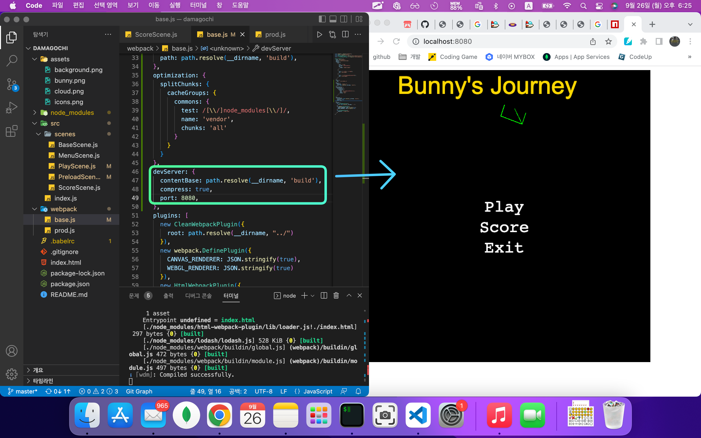
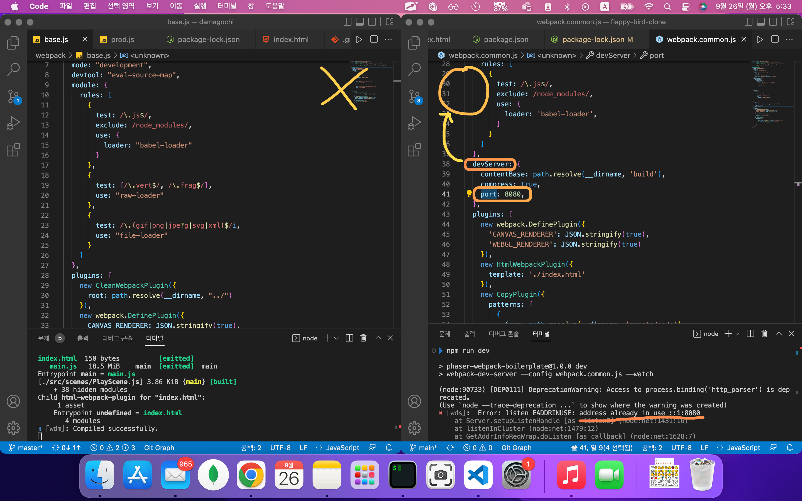
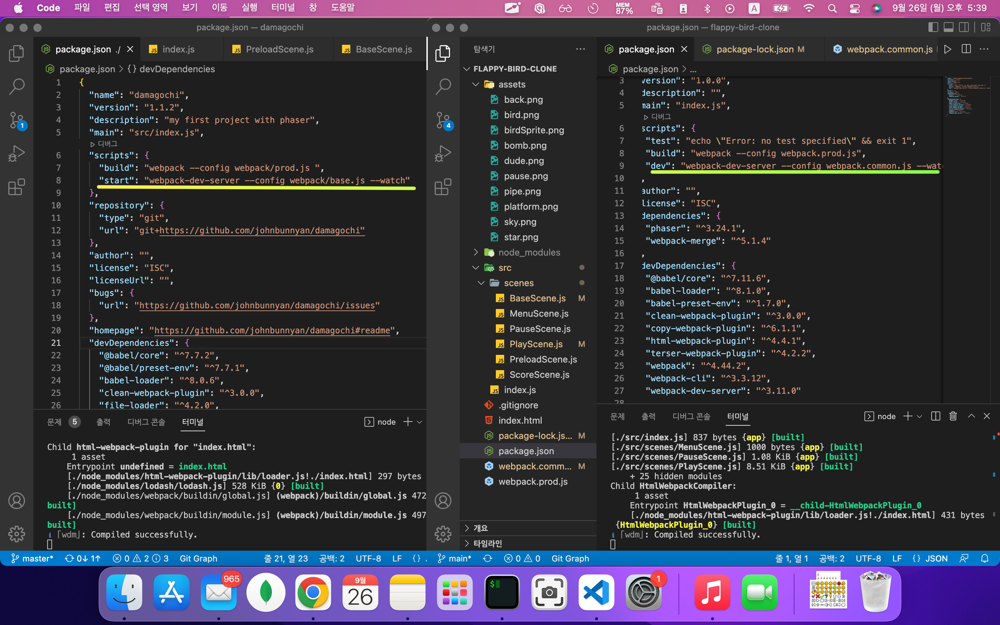
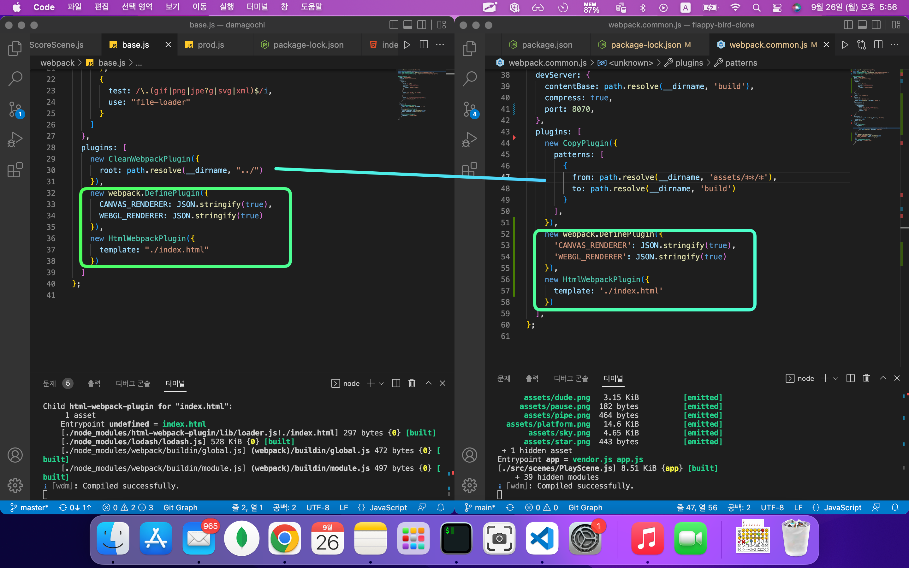
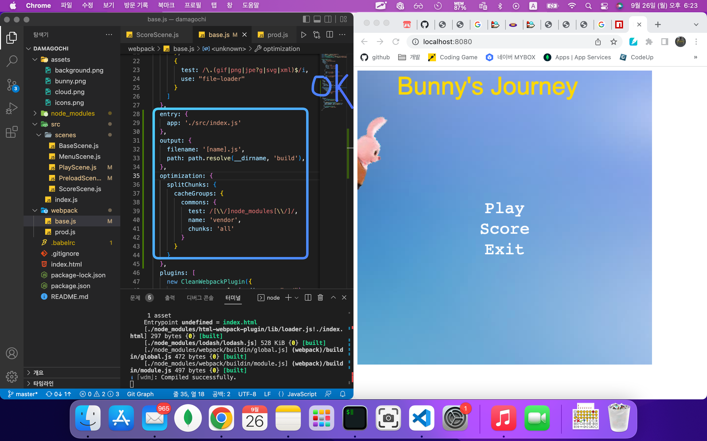
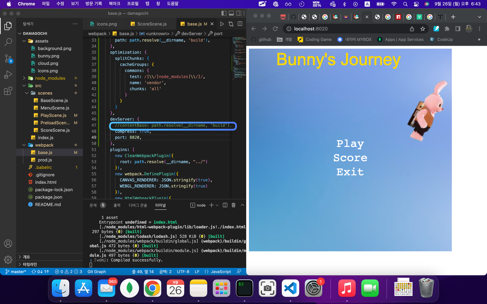

# TIL (Today-I-Learned) : 오늘 배운 내용을 README에 커밋으로 기록합니다.

<!-- 1️⃣ 날짜 및 기분 작성 -->
# 🗓 22.09.26(월) &nbsp;&nbsp;&nbsp;&nbsp;&nbsp;&nbsp;&nbsp;&nbsp;&nbsp;&nbsp;&nbsp;&nbsp;&nbsp;&nbsp; 기분: 😌


<!-- 2️⃣ 대표문장 작성 -->
오늘의 문제 해결 🐛
-------------
<!-- 강조라인 -->


<!-- 3️⃣ 배운 내용 요약 -->
<!-- > 소프트 스킬
1. flappy-bird 파트 완강
  * 응용해서 개별 프로젝트 시작
   -->
> 외면하고 싶은 웹팩...
1. 강의를 보면서 작성한 코드의 웹팩 설정에는 포트를 지정할 수 있었다. 반면 내가 커스터마이징한 프로젝트에는 포트 설정 부분이 없었다. 그래서 강의 레퍼런스의 웹팩 설정부분만 슬쩍 가져와서 내 프로젝트에 넣었더니 출력에러가 떴다.
  * </img>

2. 비교해보니 devServer라는 웹팩 패키지의 유무 차이였다.
  * </img>

3. 본격적으로 두 프로젝트의 웹팩 설정 스크립트를 비교해보기 시작했다.     
   맨처음 도입부는 package.json이었고 같은 웹팩설정 파일을 실행한다는 것을 확인했다.     
   그리고 웹 팩 파일에서 플러그인이 다르게 작성되어 있다는 것 또한 발견했지만 직접적인 원인인 devServer였다.
  * </img>
  *  </img>     

4. 이러한 경우 문제가 !어디에서! 일어나는지 파악하는 것이 우선이라고 생각하여 코드를 넓은 범위에서 좁은 범위로 주석처리해보며 디버깅을 해봤다.
   * </img>
  

5. 그랬더니 주석처리에서 에러가 걸리는 부분이 한 줄로 좁혀졌다.해당 부분에 대한 정보는 검색을 했다. 그 결과 해당 부분은 정적파일을 불러오는 곳이라는 것을 알게 되었고, 화면에 까맣게 표시되는 png파일들을 불러오지 못하고 있다는 것에 다다랐다.
     * </img>
    *  하지만 경로를 잘못지정해서 그런건지는 명확하게 해결하지 못했다.


-----
유용한 참고 링크 🔗
-------------
> 글자 색을 다양하게, 움직이게 표현하고 싶다면
<https://labs.phaser.io/edit.html?src=src\game%20objects\bitmaptext\dynamic\display%20callback%20index%20effect.js>

> 텍스트 전체 스타일을 간단하게 코드로 만들어줌!
<https://ourcade.co/tools/phaser3-text-styler/>

> 스프라이트를 움직이게 하는 간단한 예시
<https://phaser.io/examples/v3/view/game-objects/sprites/moving-sprite>


<!-- 🔴기타 마크다운 문법 참고 -->


<!-- <헤더>

# This is a H1
## This is a H2
### This is a H3
#### This is a H4
##### This is a H5
###### This is a H6 -->


<!-- <인덱스>

1. 첫번째
2. 두번째
3. 세번째

* 빨강
  * 녹색
    * 파랑

+ 빨강
  + 녹색
    + 파랑

- 빨강
  - 녹색
    - 파랑 -->


<!-- <줄 긋기>

* * *

***

*****

- - -

--------------------------------------- -->


<!-- <인용구>

> This is a first blockqute.
>	> This is a second blockqute.
>	>	> This is a third blockqute. -->

<!-- <문자굵기>

*single asterisks*
**double asterisks**
~~cancelline~~ -->


<!-- <이미지 삽입>

</img> -->


<!-- <코드박스>

```javascript
public class BootSpringBootApplication {
  public static void main(String[] args) {
    System.out.println("Hello, Honeymon");
  }
}
``` -->

<!-- <표>

First Header  | Second Header
------------- | -------------
Content Cell  | Content Cell
Content Cell  | Content Cell
-->


<!--<링크>

<http://google.com> -->