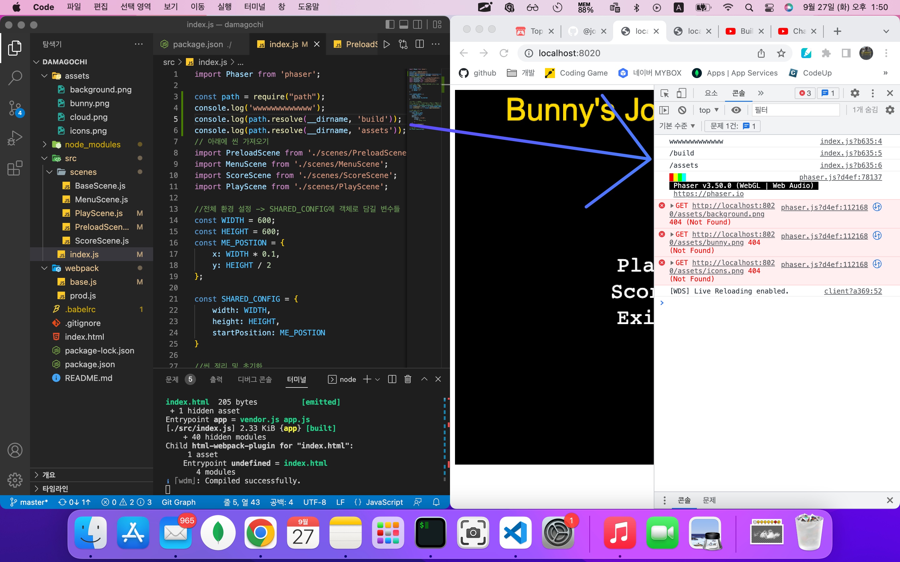
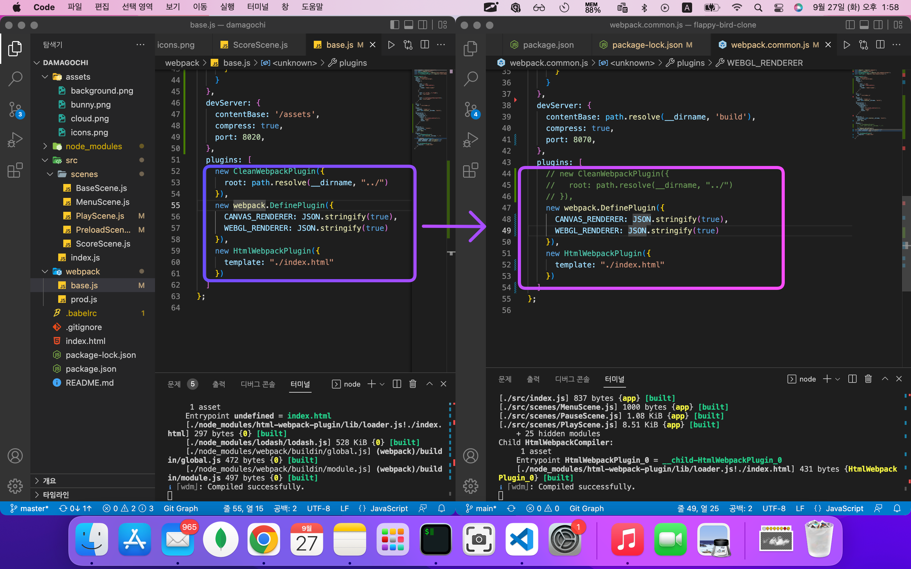
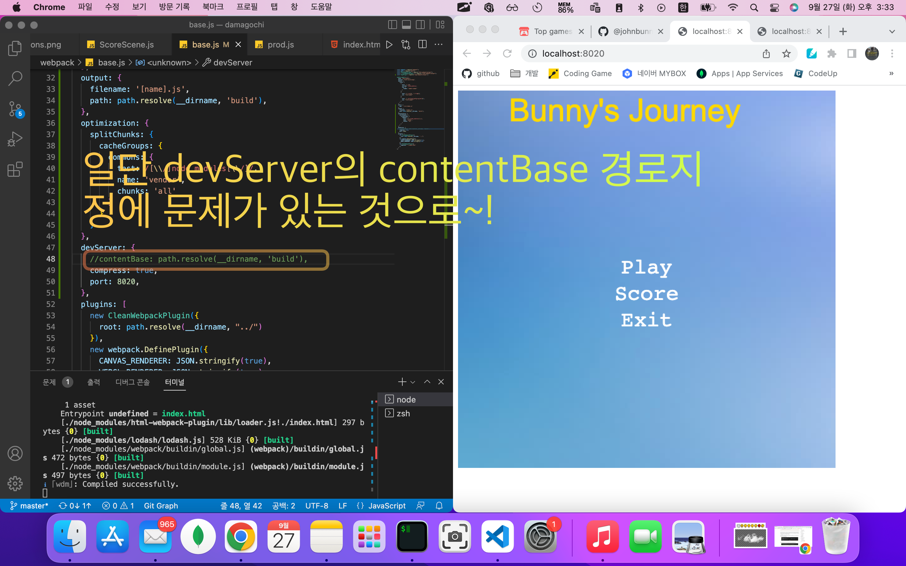
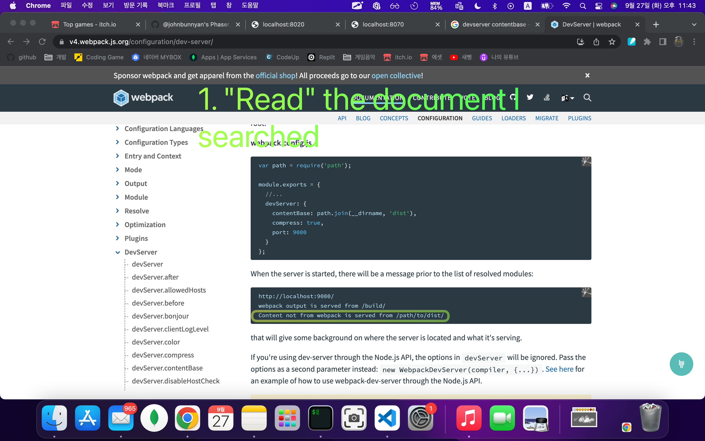
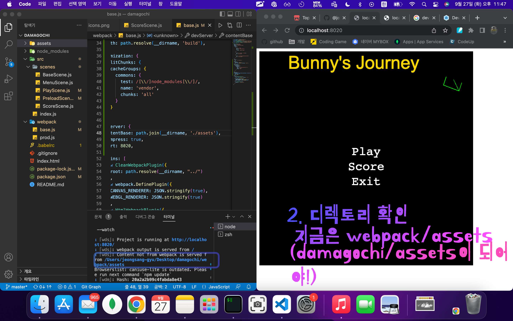
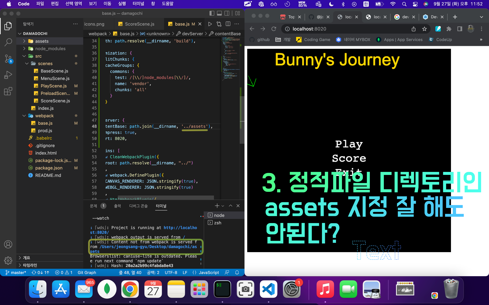
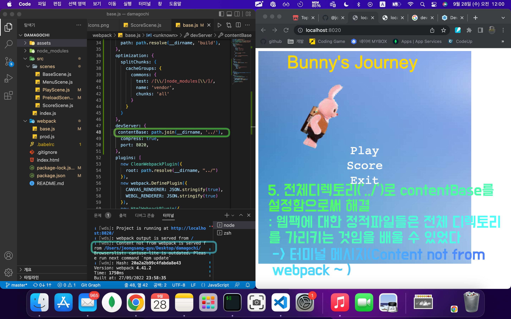

# TIL (Today-I-Learned) : 오늘 배운 내용을 README에 커밋으로 기록합니다.

<!-- 1️⃣ 날짜 및 기분 작성 -->
# 🗓 22.09.27(화) &nbsp;&nbsp;&nbsp;&nbsp;&nbsp;&nbsp;&nbsp;&nbsp;&nbsp;&nbsp;&nbsp;&nbsp;&nbsp;&nbsp; 기분: 😆


<!-- 2️⃣ 대표문장 작성 -->
오늘의 문제 해결 🐛
-------------
<!-- 강조라인 -->


<!-- 3️⃣ 배운 내용 요약 -->
<!-- > 소프트 스킬
1. flappy-bird 파트 완강
  * 응용해서 개별 프로젝트 시작
   -->
> 외면하고 싶은 웹팩... 하지만 나는 피하지 않지🔥
1. 어제부터 신경 거슬리게 하던 웹팩 devServer 설정 문제를 다시 마주하였다. 솔직히 그냥 덮고 가고 싶었는데, 알고 있다. 피했던 문제는 어떻게든 나중에 다시 마주하게 된다는 것...ㅜ     
   </img>     
그래서 내 나름대로 원인을 파악하기 위해 콘솔로그도 찍어보았다.    
   </img>     
웹팩 플러그인이 달라서 그런가 싶어서 서로 다른 플러그인 패키지를 번갈아 적용해보았지만 직접적인 원인은 아니었다.


2. 결국 의심하던 devServer가 근본적인 원인임을 못박고 고민을 이어나갔다.     
     </img>     
~~😵‍💫 여기서 살짝 고비였다~~     

3. 정신을 차리고 천천히 devServer검색어에 해당하는 공식문서를 읽어보았다.    
      </img>    
 *  웹팩을 실행했을 때 뜨는 메시지가 있다고 명시되어 있다.    

<br>

4. 해당하는 부분에 영감을 얻어 나의 프로젝트에 뜨는 터미널 메시지에 초점을 맞추어보았다.     
   1) 터미널 메시지에 맞춰서 지금 내 코드의 상태를 파악하고
   2) 이전에 가지고 있던 힌트(contentBase를 통째로 주석처리하면 정상랜더링)를 기억해서
   3) 문제해결 및 깨달음
   
      </img>        

      </img>     

      </img>     

      </img>     


> 이러한 부분에 생각보다 시간을 많이 투자하는데 가끔씩 시간이 아깝다고 느껴지는 경우가 있다.    
> 🔥하지만 시간낭비가 아니라 뭐든지 하나는 깨닫는 성장의 시간임을 기억하고 문제를 대하자.🔥

-----
유용한 참고 링크 🔗
-------------
> 웹팩 DevServer 공식문서
<https://v4.webpack.js.org/configuration/dev-server/>

> 웹팩 기본기 설명 블로그
<https://jeonghwan-kim.github.io/series/2019/12/10/frontend-dev-env-webpack-basic.html>

> 웹팩 쉬운 맛
<https://jeonghwan-kim.github.io/series/2019/12/10/frontend-dev-env-webpack-basic.html>

> 웹팩 매운 맛
<https://jeonghwan-kim.github.io/series/2019/12/10/frontend-dev-env-webpack-basic.html>


<!-- 🔴기타 마크다운 문법 참고 -->


<!-- <헤더>

# This is a H1
## This is a H2
### This is a H3
#### This is a H4
##### This is a H5
###### This is a H6 -->


<!-- <인덱스>

1. 첫번째
2. 두번째
3. 세번째

* 빨강
  * 녹색
    * 파랑

+ 빨강
  + 녹색
    + 파랑

- 빨강
  - 녹색
    - 파랑 -->


<!-- <줄 긋기>

* * *

***

*****

- - -

--------------------------------------- -->


<!-- <인용구>

> This is a first blockqute.
>	> This is a second blockqute.
>	>	> This is a third blockqute. -->

<!-- <문자굵기>

*single asterisks*
**double asterisks**
~~cancelline~~ -->


<!-- <이미지 삽입>

</img> -->


<!-- <코드박스>

```javascript
public class BootSpringBootApplication {
  public static void main(String[] args) {
    System.out.println("Hello, Honeymon");
  }
}
``` -->

<!-- <표>

First Header  | Second Header
------------- | -------------
Content Cell  | Content Cell
Content Cell  | Content Cell
-->


<!--<링크>

<http://google.com> -->