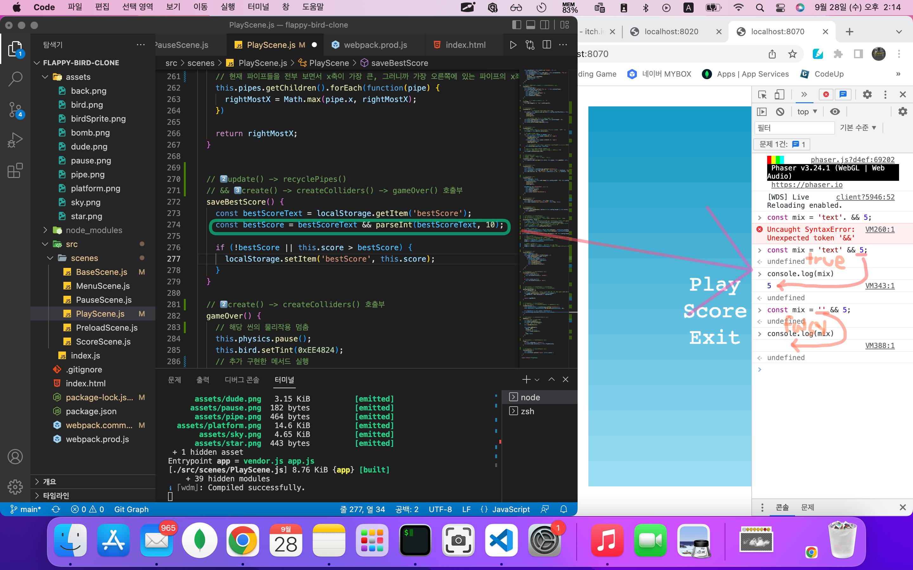

# TIL (Today-I-Learned) : 오늘 배운 내용을 README에 커밋으로 기록합니다.

<!-- 1️⃣ 날짜 및 기분 작성 -->
# 🗓 22.10.03(월) &nbsp;&nbsp;&nbsp;&nbsp;&nbsp;&nbsp;&nbsp;&nbsp;&nbsp;&nbsp;&nbsp;&nbsp;&nbsp;&nbsp; 기분: ☺️


<!-- 2️⃣ 대표문장 작성 -->
오늘의 문제 해결 🐛
-------------
<!-- 강조라인 -->


<!-- 3️⃣ 배운 내용 요약 -->
<!-- > 소프트 스킬
1. flappy-bird 파트 완강
  * 응용해서 개별 프로젝트 시작
   -->
> 개천절
1. 페이저 대망의 본 강의, 플랫폼형 게임 파트를 듣기 시작했다. 오늘은 맵과 캐릭터만 띄웠는데, Tiled라는 앱을 추가적으로 사용하는 것이 인상적이고 재밌었다.
   <!-- </img>      -->

2. 깃 명령어를 추가적으로 검색하게 되었다. 보통 vsCode 익스텐션으로 깃 로그를 확인했는데, 문득 명령어도 알아두면 좋지 않을까 생각했다.
  ```bash
  git log 
  
  아래는 최근 두개의 결과만 보여줌
  git log -p -2

  프리티 기능
  git log --pretty=oneline(short,full,fuller)
  
  ```   
   <!-- 참고🔗 <https://dlsdn73.tistory.com/287>   
   </img>      -->


 


-----
유용한 참고 링크 🔗
-------------
## 1.깃 명령어 공식문서
<https://git-scm.com/book/ko/v2/Git%EC%9D%98-%EA%B8%B0%EC%B4%88-%EC%BB%A4%EB%B0%8B-%ED%9E%88%EC%8A%A4%ED%86%A0%EB%A6%AC-%EC%A1%B0%ED%9A%8C%ED%95%98%EA%B8%B0>


<!-- 🔴기타 마크다운 문법 참고 -->


<!-- <헤더>

# This is a H1
## This is a H2
### This is a H3
#### This is a H4
##### This is a H5
###### This is a H6 -->


<!-- <인덱스>

1. 첫번째
2. 두번째
3. 세번째

* 빨강
  * 녹색
    * 파랑

+ 빨강
  + 녹색
    + 파랑

- 빨강
  - 녹색
    - 파랑 -->


<!-- <줄 긋기>

* * *

***

*****

- - -

--------------------------------------- -->


<!-- <인용구>

> This is a first blockqute.
>	> This is a second blockqute.
>	>	> This is a third blockqute. -->

<!-- <문자굵기>

*single asterisks*
**double asterisks**
~~cancelline~~ -->


<!-- <이미지 삽입>

</img> -->


<!-- <코드박스>

```javascript
public class BootSpringBootApplication {
  public static void main(String[] args) {
    System.out.println("Hello, Honeymon");
  }
}
``` -->

<!-- <표>

First Header  | Second Header
------------- | -------------
Content Cell  | Content Cell
Content Cell  | Content Cell
-->


<!--<링크>

<http://google.com> -->