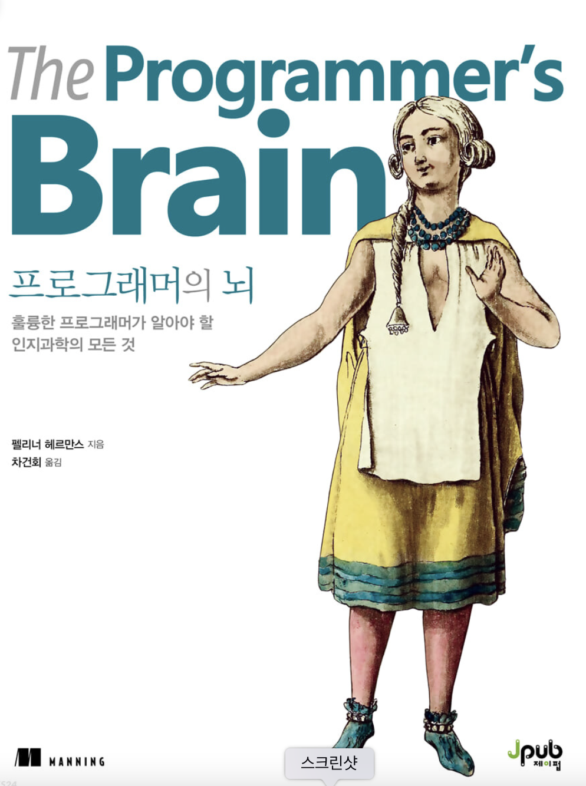
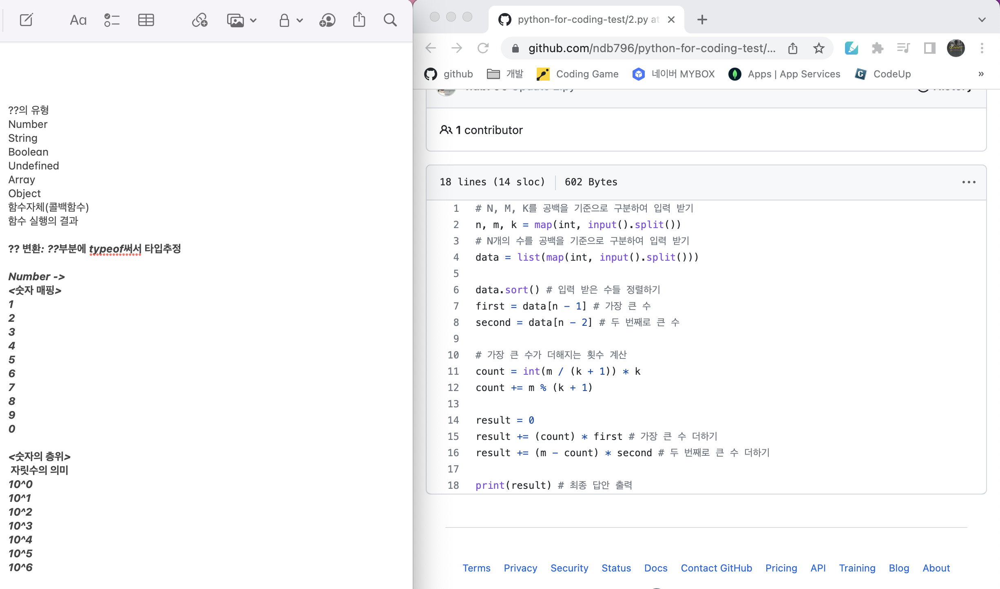
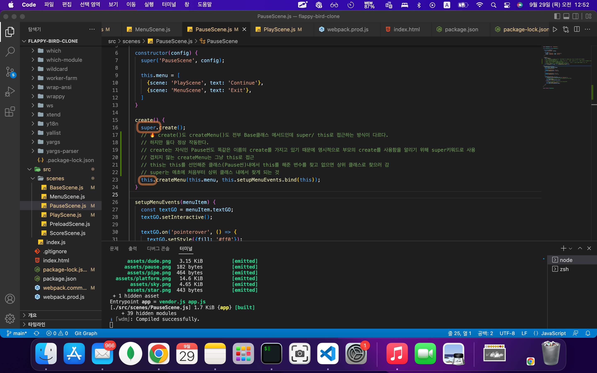

# TIL (Today-I-Learned) : 오늘 배운 내용을 README에 커밋으로 기록합니다.

<!-- 1️⃣ 날짜 및 기분 작성 -->
# 🗓 22.10.12(수) &nbsp;&nbsp;&nbsp;&nbsp;&nbsp;&nbsp;&nbsp;&nbsp;&nbsp;&nbsp;&nbsp;&nbsp;&nbsp;&nbsp; 기분: 🦾


<!-- 2️⃣ 대표문장 작성 -->


<!-- 강조라인 -->


<!-- 3️⃣ 배운 내용 요약 -->
<!-- > 소프트 스킬
1. flappy-bird 파트 완강
  * 응용해서 개별 프로젝트 시작
   -->
> 문득 떠오른 아이디어
1. 오늘 아침에 운동을 하다 문득 떠오른 아이디어가 있다. 예전에도 생각했던 것이지만, 나는 '소설가'가 되고 싶은 사람이다. 근데 나의 글을 누군가가 읽는 것은 또 부끄러워해서 쓰지 못한다. 그래서 생각했던 것은, 아무도 알아볼 수 없는 소설을 쓰는 것이었다. 사실 그것이 게임을 만들어서 스토리를 표현하겠다는 아이디어보다 먼저 떠오른 생각이었다.    
   </img>     

2. 요즘 읽고 있는 책인데, 코드를 읽을 때 개발자의 뇌 속에서 일어나는 일을 뇌신경과학과 접목시켜 설명하고 있다. 흥미로웠던 점은, 변수를 그냥 '변수'라고 뭉뚱그리는 것이 아니라, 변수의 역할에 따라 이름을 따로 붙여 역할을 나누는 한 개발자의 프레임워크를 소개한 부분이다. </br>
3. 저 부분을 읽고서 마침내 든 아이디어는, 어떤 코드든 그 코드를 어떤 프로그램에 넣으면 그 코드의 내용을 분석해 의미를 부여하거나 스토리 구성 요소로 변환할 수 있지 않을까 하는 생각이다. 그렇게 되면 분명 코드에 대한 내 거부감도 줄어들고 오히려 코드를 반기지 않을까 싶다.
4. 그래서 오늘은 그 아이디어를 실행에 옮기기로 했다.
5. 간략한 계획
  * 1. 변환 프로그램 작성
  * 2. 백엔드 구성
  * 3. 리액트로 프론트앤드 구성 -> 기왕이면 웹앱까지 도전해보고 싶음

6. 일단 변환 프로그램 작성을 위해 변환 로직을 정리 중!     
   * 문자열의 의미는 새롭게 정의하고, 숫자도 개별 숫자와 자릿수의 의미를 다시 매핑해야 한다.    
   </img>    

***

오늘의 코드 읽기 🐝
-----
없음


***
  오늘의 문제 해결 🐛     
-------------
없음

   <!-- 참고🔗 <https://dlsdn73.tistory.com/287>   
   </img>      -->


 


-----
유용한 참고 링크 🔗
-------------


<!-- 🔴기타 마크다운 문법 참고 -->


<!-- <헤더>

# This is a H1
## This is a H2
### This is a H3
#### This is a H4
##### This is a H5
###### This is a H6 -->


<!-- <인덱스>

1. 첫번째
2. 두번째
3. 세번째

* 빨강
  * 녹색
    * 파랑

+ 빨강
  + 녹색
    + 파랑

- 빨강
  - 녹색
    - 파랑 -->


<!-- <줄 긋기>

* * *

***

*****

- - -

--------------------------------------- -->


<!-- <인용구>

> This is a first blockqute.
>	> This is a second blockqute.
>	>	> This is a third blockqute. -->

<!-- <문자굵기>

*single asterisks*
**double asterisks**
~~cancelline~~ -->


<!-- <이미지 삽입>

</img> -->


<!-- <코드박스>

```javascript
public class BootSpringBootApplication {
  public static void main(String[] args) {
    System.out.println("Hello, Honeymon");
  }
}
``` -->

<!-- <표>

First Header  | Second Header
------------- | -------------
Content Cell  | Content Cell
Content Cell  | Content Cell
-->


<!--<링크>

<http://google.com> -->